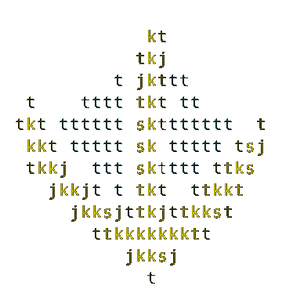

# Footup MVC PHP Framework

<div align="center">
  
  <h2 class="name_title">FOOTUP MVC FRAMEWORK - 0.1.6</h2>
</div>

A Rich Featured LightWeight PHP MVC Framework :

* CLI support for generating Controller, Model, Middle, Assets and View files ( [adhocore/php-cli](https://github.com/adhocore/php-cli) modified and used thanks :) )
* Translation support
* Config using PHP File or .env (Rename env to .env)
* Request
* Response
* Validator (Form Validation - Not validating UploadedFile) Thanks to [pdscopes/php-form-validator](https://github.com/pdscopes/php-form-validator)
* Pagination (Pagination and Pagination View) Thanks to [iranianpep/paginator](https://github/iranianpep/paginator)
* Session
* Email (CodeIgniter 4 Email Class)
* Routing
* Controller AND Middleware (But here we call it just Middle and are specific)
* Model RelationShips ($hasOne, $hasMany, $belongsTo, $belongsToMany)
* Model QueryBuilder
* Model Events CallBacks
* Files (Upload File)
* Extensible (You can integrate any library you want and you can add (news folders and class) in the App Directory using psr4 autoloading mecanism)

### ReadMe should be updated -- (Soon i'll create the docs website for FootUp PHP MVC Framework)
--------------------

## Directories tree
```
FOOTUP MVC Framework
├── app
│   ├── Config
│   │   ├── Autoload.php
│   │   ├── Config.php
│   │   ├── Constants.php
│   │   ├── Email.php
│   │   ├── Form.php
│   │   ├── Fuel.php
│   │   ├── Paginator.php
│   │   └── Routes.php
│   ├── Controller
│   │   ├── BaseController.php
│   │   └── Home.php
│   ├── Functions.php
│   ├── Lang
│   ├── Libs
│   ├── Middle
│   │   └── Maintenance.php
│   ├── Model
│   │   └── Contact.php
│   └── View
│       └── home.php
├── composer.json
├── core
│   ├── Boot.php
│   ├── Cli
│   │   ├── Commands
│   │   │   ├── Assets.php
│   │   │   ├── Controller.php
│   │   │   ├── Middle.php
│   │   │   ├── Model.php
│   │   │   ├── Multiple.php
│   │   │   ├── Scaffold.php
│   │   │   └── View.php
│   │   ├── Exception
│   │   │   ├── Exception.php
│   │   │   ├── InvalidArgumentException.php
│   │   │   ├── InvalidParameterException.php
│   │   │   └── RuntimeException.php
│   │   ├── Helper
│   │   │   ├── InflectsString.php
│   │   │   ├── Normalizer.php
│   │   │   ├── OutputHelper.php
│   │   │   └── Shell.php
│   │   ├── Input
│   │   │   ├── Argument.php
│   │   │   ├── Command.php
│   │   │   ├── Groupable.php
│   │   │   ├── Option.php
│   │   │   ├── Parameter.php
│   │   │   ├── Parser.php
│   │   │   └── Reader.php
│   │   ├── IO
│   │   │   └── Interactor.php
│   │   ├── Konsole.php
│   │   ├── logo
│   │   ├── Output
│   │   │   ├── Color.php
│   │   │   ├── Cursor.php
│   │   │   ├── Table.php
│   │   │   └── Writer.php
│   │   └── Tpl
│   │       ├── Controller.tpl
│   │       ├── Middle.tpl
│   │       ├── Model.tpl
│   │       └── View.tpl
│   ├── Config
│   │   ├── Autoload.php
│   │   ├── Config.php
│   │   ├── DotEnv
│   │   │   ├── DotEnv.php
│   │   │   └── Exception
│   │   │       ├── Exception.php
│   │   │       └── InvalidPathException.php
│   │   ├── Email.php
│   │   └── Mime.php
│   ├── Controller.php
│   ├── Files
│   │   ├── File.php
│   │   └── FileSystem.php
│   ├── footup-ascii-art.png
│   ├── Footup.php
│   ├── Functions.php
│   ├── Html
│   │   ├── Form.php
│   │   └── Html.php
│   ├── Http
│   │   ├── Request.php
│   │   ├── Response.php
│   │   └── Session.php
│   ├── I18n
│   │   ├── Exceptions
│   │   │   └── I18nException.php
│   │   ├── TimeDifference.php
│   │   └── Time.php
│   ├── Lang
│   │   ├── fr
│   │   │   ├── core.json
│   │   │   ├── date.json
│   │   │   ├── db.json
│   │   │   ├── email.json
│   │   │   ├── file.json
│   │   │   ├── http.json
│   │   │   ├── paginator.json
│   │   │   ├── validator.json
│   │   │   └── view.json
│   │   └── Lang.php
│   ├── Model.php
│   ├── Orm
│   │   ├── BaseModel.php
│   │   ├── DbConnection.php
│   │   └── QueryBuilder.php
│   ├── Paginator
│   │   ├── AbstractPaginator.php
│   │   ├── Page.php
│   │   ├── PaginatorException.php
│   │   ├── PaginatorInterface.php
│   │   ├── Paginator.php
│   │   └── Views
│   │       └── default.php
│   ├── Routing
│   │   ├── Middle.php
│   │   ├── Route.php
│   │   └── Router.php
│   └── Utils
│       ├── Arrays
│       │   ├── Arrayable.php
│       │   ├── ArrDots.php
│       │   ├── Arr.php
│       │   ├── Collection.php
│       │   └── Dots.php
│       ├── ClassLocator.php
│       ├── Shared.php
│       ├── Str.php
│       └── Validator
│           ├── Validate.php
│           └── Validator.php
├── env
├── footup
├── LICENSE
├── public
│   ├── assets
│   │   ├── avatar.jpg
│   │   ├── css
│   │   │   └── style.css
│   │   └── js
│   │       └── script.js
│   ├── error
│   │   ├── 404.html
│   │   └── 500.html
│   ├── favicon.svg
│   ├── index.php
│   └── uploads
│       └── cache
└── README.md
```

## Description

FOOTUP MVC Framework focus primarily to speed and minimalistic. It's **220 Kb zip**, **140 kb gz**.
It render withing **0.001 seconds** (I used a PHP 8.0.7 environment to write and test it).

My goal is doing a thing that i'm the first person that use it with ease.
I added some features that help me working faster on my all day's work.

## Requirements

Yo ! You can download this directly and use it without no need to external dependancy.
It support composer libraries but i have not published **footup** yet to packagist.

So you need:
* *PDO extension*
* *mb_string*
* *intl*
* *json*

## WalkThrough

### CLI

For now I added just generators commands

To show help:
```bash
nuka@hacker_pc:~$ php footup 
```

To generate controller:
```bash
nuka@hacker_pc:~$ php footup controller controllerName
```
Don't be so shy, try yourself

### Request

The request and the router class are the **BMW Motors**
They hold many thing helpful. Here how we use the request:

#### You are in the controller ? use like this :

```php
// using get function to get the page=3 present in the url
$this->request->get("page");

// you can use like this to get the page
$this->request->page;

// What ? you typing enough ? and that ?
request()->page;

// And What ? how to get file with name: image ?
// You can use as below
$this->request->image; // or $this->request->getFile('image')

// And What if image[] as multiple files ?
// You can use as below
$this->request->getFiles('image');

# Yes you can access the request using the global function request()
```

#### But Yes, with the request you can validate data via validator like this :

```php
// using get function to validate the page=3 present in the url
$this->request->withGetInput()->validate(["page" => "is:int"]);

// What ? you typing enough ? and that ?
request()->withGetInput()->validate(["page" => "is:int"]);

# Yes you can access the request using the global function request()
```

#### *Don't be so shy, explore the request class, your editor will autocomplete*


### The Response object is available in the controller :

```php
// using get function to validate the page=3 present in the url
$this->response->json(["page" => 2], true); // second parameter to echo directly

# Yes you can access the response using the global function response()
```

### The Session 

This is a shared class so the data withing it remain the same, here is the example  :

```php
// using set function to set session value
$this->session->set(["page" => 2]); // or $this->session->page = 2

// What ? you typing enough ? and that ?
session("page", 2); // session()->set("page", 2); or session()->page = 2;

// What ? i want to get the page ?
// So
session("page"); // session()->get("page"); or session()->page;

# Yes you can access the session using the global function session() as shown
```

### Validator :
If you validate data with validator, the validate function return **TRUE** if all passed and **FALSE** otherwise

```php
// Via request
// with post data
$this->request->withPostInput()->validate(["page" => "is:int"]);

// With post and get data
request()->withInput()->validate(["page" => "is:int"]);

// With other data
request()->with(["page" => 2])->validate(["page" => "is:int"]);

// So how to get Error ?
// Simple
validator()->getError("page"); // request()->getValidator()->getErrors(); to grab all

# Yes you can access the validator using the global function validator()
# You can validate using the global function validate() too
```

## I will write documentation if if if .... LOL -- If you do it, help me !
### I think i don't like writing LOL

### Using the Model

```php
<?php

namespace App\Model;
use Footup\Model;

class Contact extends Model{
  // If not defined, the name of this class is used
  protected $table = 'contact';
  /**
   * PrimaryKey
   *
   * @var string
   */
  protected $primaryKey = 'idcont';

  protected $beforeInsert         = [];
  protected $beforeFind           = [];
  protected $beforeDelete         = [];
  protected $beforeUpdate         = [];
  protected $afterInsert          = [];
  protected $afterFind            = [];
  protected $afterDelete          = [];
  protected $afterUpdate          = [];
}

// Using the model Contact
.....
  use App\Model\Contact;
  ....
  // Retrouve tout | retrieve all
  $contacts = Contact::all();
  ------------ others methods --------------
  $c = new Contact();
  $contacts = $c->get();
  foreach($contacts as $contact)
    echo $contact->email;
  
  # you can also use 
  $contact->setEmail("fuck@you.yh");

  // Generating form ******
  $contact->getForm();

  var_dump($c->firstByEmail('faus@fizz.io'));
  ..........................
  
```

### _Globals Functions | Fonctions glabales_

> **request($index = null, $arg = null)**

```php
  /**
   * Une fonction pour exposer l'objet Request
   *
   * @param mixed $index
   * @param mixed $arg
   * @return Footup\Http\Request|mixed
   */
  request($index = null, $arg = null)
```

> **calledController($withNamespace = true)**

```php
  /**
   * Retrouve le controlleur en cours d'utilisation
   *
   * @param boolean $withNamespace
   * @return string
   */
  calledController($withNamespace = true)
```

> **calledMethod()**

```php
  /**
   * Retrouve la méthode couremment utilisée
   *
   * method of the current called controller
   * 
   * @return string
   */
  calledMethod()
```

> And many mores others globals functions

### Uploading file | Téleverser un fichier

```php
  #eg. file field = image
  # @uses one below
  request('image') or request()->image or request()->file('image')

  # remember that request is available directly in the controller so :
  $this->request->image

  # et pour enregistrer le fichier | and for saving :
  request('image')->save(?string $destinationName = null, bool $replace = true) or request()->image->save(?string $destinationName = null, bool $replace = true) or request()->file('image')->save(?string $destinationName = null, bool $replace = true)

  # remember that request is available directly in the controller so :
  $this->request->image
```

### Getting Auto Genereted Form | Avoir un formulaire auto généré

```php
  $contact = new ContactModel();
  $contact->getForm("#", [], true /* true to print */ )
  # or use
  echo $contact->getForm();
```

### QueryBuilder Methods | Méthode de Model QueryBuilder

### **_# model->from($table, $reset = true): $this_**

> Utilise **$reset = false** si vous ne souhaiter pas recommencer une requête.
Utilise **$table** pour changer de table (cette méthode vous l'utiliserez rarement)
<!-- -->

### **_# model->join($table, $fields, $type = 'INNER', $operator = '='): $this_**

> * $type doit être un dans ['INNER', 'LEFT OUTER', 'RIGHT OUTER', 'FULL OUTER']
> * $fields string|array ex: "user.id = article.id_user" | ["user.id" => "article.id_user"]
<!-- -->

### **_# model->leftJoin($table, $fields, $operator = '='): $this_**

> * $fields string|array ex: "user.id = article.id_user" | ["user.id" => "article.id_user"]
<!-- -->

### **_# model->rightJoin($table, $fields, $operator = '='): $this_**

> * $fields string|array ex: "user.id = article.id_user" | ["user.id" => "article.id_user"]
<!-- -->

### **_# model->where($key, $val = null, $operator = null, $link = ' AND ', $escape = true): $this_**

> * $key string|array ex: "id = 1" | ["id" => 1]
> * $link string where $link is AND | OR | IS
> * $fields string|array ex: "arnauld" | [2, 3, 5] for $operator IN | NOT IN
<!-- -->

### **_# model->whereOr($key, $val = null, $operator = null, $link = ' AND ', $escape = true): $this_**

>
  ```php
    /**
      * @param string|array $key
      * @param null $operator
      * @param null $val
      * @return $this
      */
    public function whereOr($key, $val = null, $operator = null, $escape = true)
  ```

### **_# model->whereIn($key, array $val, $escape = true) | whereOrIn($key, array $val, $escape = true): $this_**

>
  ```php
    /**
     * @param $key
     * @param array $val
     * @return $this
     */
    public function whereIn($key, array $val, $escape = true)
  ```

### **_# model->whereRaw($str) | whereOrRaw($str): $this_**

>
  ```php
    /**
     * @param string $str
     * @return $this
     */
    public function whereRaw($str)
  ```

### **_# model->whereNotIn($key, array $val, $escape = true) | whereOrNotIn($key, array $val, $escape = true): $this_**

>
  ```php
    /**
     * @param $key
     * @param array $val
     * @return $this
     */
    public function whereNotIn($key, array $val, $escape = true)
  ```

### **_# model->whereNotNull($key) | whereOrNotNull($key): $this_**

>
  ```php
    /**
     * @param string $key
     * @return $this
     */
    public function whereNotNull($key)
  ```

### **_# model->whereNull($key) | whereOrNull($key): $this_**

>
  ```php
    /**
     * @param string $key
     * @return $this
     */
    public function whereNull($key)
  ```

### **_# model->asc($field): $this_**

>
  ```php
    /**
     * Adds an ascending sort for a field.
     *
     * @param string $field Field name
     * @return object Self reference
     */
    public function asc($field)
  ```

### **_# model->desc($field): $this_**

>
  ```php
    /**
     * Adds an descending sort for a field.
     *
     * @param string $field Field name
     * @return object Self reference
     */
    public function desc($field)
  ```

### **_# model->orderBy($field, $direction = 'ASC'): $this_**

>
  ```php
    /**
     * Adds fields to order by.
     *
     * @param string $field Field name
     * @param string $direction Sort direction
     * @return object Self reference
     */
    public function orderBy($field, $direction = 'ASC')
  ```

### **_# model->insert($data): bool_**

>
  ```php
    /**
     * Builds an insert query.
     *
     * @param array $data Array of key and values to insert
     * @return bool
     */
    public function insert(array $data = [])
  ```

### **_# model->update($data): bool_**

Cette méthode doit être utilisée après une clause where

>
  ```php
    /**
     * Builds an update query.
     *
     * @param array $data Array of keys and values, or string literal
     * @return bool
     */
    public function update($data)
  ```
  
### **_# model->delete($where): bool_**

>
  ```php
    /**
     * Builds a delete query.
     *
     * @param string|int|array $where Where conditions
     * @return bool
     */
    public function delete($where = null)
  ```
  
### **_# model->sql($raw_sql): $this_**

Si **$raw_sql** est null, la méthode retourne une chaine de caractères, retourne **$this** sinon.

>
  ```php
    /**
     * Gets or sets the SQL statement.
     *
     * @param string|array SQL statement
     * @return self|string SQL statement
     */
    public function sql($sql = null)
  ```

### **_# model->save($objet = null, $db_fields = null): bool_**

* _$object_: the object to get data on default: $this
* _$db_array_: database fields ex: ['email', 'username']

>
  ```php
    /**
     * Saves an object to the database.
     *
     * @param object $objet Class instance
     * @param array $db_fields Select database fields to save (insert or update)
     * @return boolean
     */
    public function save($objet = null, array $db_fields = null)
  ```

### **_# model->remove($objet = null): bool_**

* _$object_: the object to get primaryKey data on default: $this

>
  ```php
    /**
     * Removes an object from the database.
     *
     * @param object
     * @return boolean
     */
    public function remove($objet = null)
  ```
  
> **NOTE:** Si tu as déjà utilisé un framework comme **CodeIgniter 4** tu maitriseras vite
> Autres méthodes groupBy, having, limit, offset, distinct, between, select, last, find, min, count, max, avg, one, first et des **méthodes dynamiques** comme firstBy{Field}, lastBy{Field}, findBy{Field} où {Field} est un attribut de la table.
<!-- -->

```php

/**
 * Gets the database connection instance PDO.
 *
 * @return object Database connection
 */
public function getDb()
```

```php
  /**
   * Executes a sql statement.
   *
   * @return object Query results object
   * @throws Exception When database is not defined
   */
  public function execute(array $params = [])
```

```php
  /**
   * Perform a query
   *
   * @param string $select
   * @param array|string $where
   * @param int $limit
   * @param int $offset
   * @return array - of object class
   */
  public function get($select = "*", $where = null, $limit = null, $offset = null)
```

```php
  # Autres Méthodes
  ==================

  /**
   * Get the table name for this ER class.
   * 
   * @access public
   * @return string
   */
  getTable ()

  /**
   * Get the primaryKey
   * 
   * @access public
   * @return string
   */ 
  getPrimaryKey()

  /**
   * Get model property fields by data table.
   *
   * @access public
   * @return array of available columns
   */
  getFields()

  /**
   * Create new data row.
   *
   * @access public
   * @param array $properties
   * @return object Model instance
   * @return bool
   */
  create(Array $properties)

  /**
   * Find one model in the database.
   * or create if not exists.
   *
   * @access public
   * @param array $properties
   * @return object Model instance
   * @return array|bool if error occured
   */
  findOrCreate(Array $properties = null)

  /**
   * Find all model in the database.
   *
   * @access public
   * @param mixed $where
   * @return array|object
   */
  public static function all($where = null)
```

## Exemple de création de Controller

```php
<?php

namespace App\Controller;
use App\Model\Contact;

class Home extends BaseController{

  public function index(){
    // Retrouve la méthod utilisée | HTTP Verb
    if($this->request->method() === 'post'){

      // retrouve un fichier | retrouve uploaded file
      $image = $this->request->file('image');
      // save
      $image->save();
      // get the name of the moved file 
      echo $image->name;
    }

    // Using model Contact
    // all() est la seule méthode statique | all() is the only static method
    $contacts = Contact::all();
    $contacts = (new Contact())->get());
    
    // Afficher la vue | display the vue
    return $this->view("accueil", [
        "titre" => "Accueil"
    ]);
  }

}
  
```

## **Credits Libraries**
**Paginator** [iranianpep/paginator](https://github/iranianpep/paginator)

**Form Validator** [pdscopes/php-form-validator](https://github.com/pdscopes/php-form-validator)

**PHP Arrays** [pdscopes/php-arrays](https://github.com/pdscopes/php-arrays)

**PHP CLI by Adhocore** [adhocore/php-cli](https://github.com/adhocore/php-cli)

## **License**

### __BSD 3-Clause License__

Copyright (c) 2021, Faustfizz <youssoufmbae2@gmail.com>
All rights reserved.

Redistribution and use in source and binary forms, with or without
modification, are permitted provided that the following conditions are met:

1. Redistributions of source code must retain the above copyright notice, this
   list of conditions and the following disclaimer.

2. Redistributions in binary form must reproduce the above copyright notice,
   this list of conditions and the following disclaimer in the documentation
   and/or other materials provided with the distribution.

3. Neither the name of the copyright holder nor the names of its
   contributors may be used to endorse or promote products derived from
   this software without specific prior written permission.

THIS SOFTWARE IS PROVIDED BY THE COPYRIGHT HOLDERS AND CONTRIBUTORS "AS IS"
AND ANY EXPRESS OR IMPLIED WARRANTIES, INCLUDING, BUT NOT LIMITED TO, THE
IMPLIED WARRANTIES OF MERCHANTABILITY AND FITNESS FOR A PARTICULAR PURPOSE ARE
DISCLAIMED. IN NO EVENT SHALL THE COPYRIGHT HOLDER OR CONTRIBUTORS BE LIABLE
FOR ANY DIRECT, INDIRECT, INCIDENTAL, SPECIAL, EXEMPLARY, OR CONSEQUENTIAL
DAMAGES (INCLUDING, BUT NOT LIMITED TO, PROCUREMENT OF SUBSTITUTE GOODS OR
SERVICES; LOSS OF USE, DATA, OR PROFITS; OR BUSINESS INTERRUPTION) HOWEVER
CAUSED AND ON ANY THEORY OF LIABILITY, WHETHER IN CONTRACT, STRICT LIABILITY,
OR TORT (INCLUDING NEGLIGENCE OR OTHERWISE) ARISING IN ANY WAY OUT OF THE USE
OF THIS SOFTWARE, EVEN IF ADVISED OF THE POSSIBILITY OF SUCH DAMAGE.
